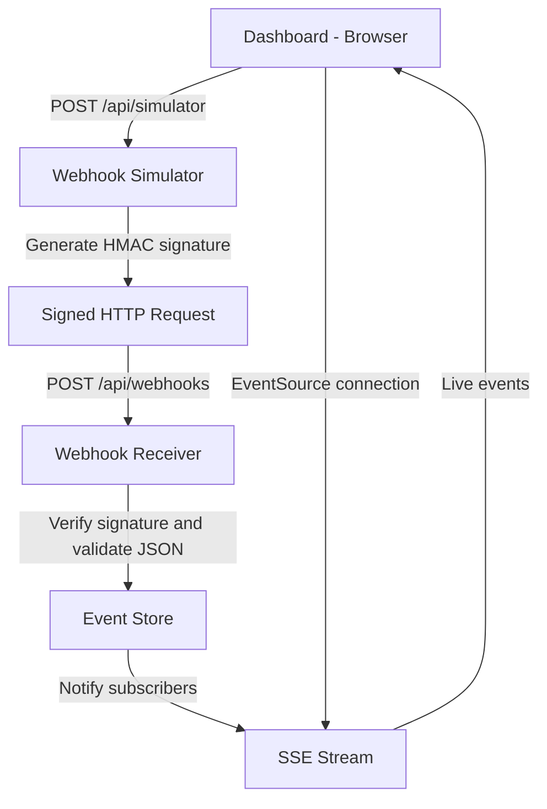

# Webhooks Playground

A hands-on learning project for understanding how webhooks work, how HTTP event delivery is handled, and how to build a real-time monitoring dashboard with **Next.js, TypeScript, Route Handlers, Server-Sent Events (SSE), and HMAC signatures**.

The project simulates a webhook sender and receiver locally, allowing you to trigger events, inspect delivery attempts, simulate failures, retry failed deliveries, and observe incoming events in real time.

## Table of Contents

* [Project Goals](#project-goals)
* [Technologies](#technologies)
* [Architecture](#architecture)
* [Getting Started](#getting-started)
* [Environment Variables](#environment-variables)
* [How Webhooks Work](#how-webhooks-work)
* [How Server-Sent Events Work](#how-server-sent-events-work)
* [Webhook Delivery Flow](#webhook-delivery-flow)
* [HMAC Signature Verification](#hmac-signature-verification)
* [Duplicate Event Detection](#duplicate-event-detection)
* [Failure Simulation and Retries](#failure-simulation-and-retries)
* [API Endpoints](#api-endpoints)
* [Project Structure](#project-structure)
* [Testing with curl](#testing-with-curl)
* [Important Concepts Learned](#important-concepts-learned)
* [Current Limitations](#current-limitations)
* [Possible Improvements](#possible-improvements)

## Project Goals

The main goal is to understand webhook delivery by building a working implementation rather than relying only on theory.

By completing this project, you learn how to:

* Receive HTTP webhook requests using Next.js Route Handlers.
* Validate incoming JSON payloads.
* Understand the difference between a webhook and a real-time browser connection.
* Build a live dashboard using Server-Sent Events.
* Share event data between API routes through a server-side event store.
* Authenticate webhook requests using HMAC-SHA256 signatures.
* Keep secrets on the server instead of exposing them to the browser.
* Detect duplicate events using event IDs.
* Simulate receiver failures and inspect HTTP status codes.
* Track delivery attempts and manually retry failed events.
* Understand why production webhook systems need persistence, retry policies, and stronger operational safeguards.

## Technologies

| Technology                               | Purpose                                               |
| ---------------------------------------- | ----------------------------------------------------- |
| Next.js App Router                       | Application framework                                 |
| TypeScript                               | Type safety                                           |
| Next.js Route Handlers                   | HTTP API endpoints                                    |
| React                                    | Interactive dashboard                                 |
| Server-Sent Events (SSE)                 | Push events from the server to the browser            |
| Web Crypto alternative: Node.js `crypto` | HMAC signing and verification                         |
| `ReadableStream`                         | Streaming responses for SSE                           |
| `EventSource`                            | Browser API for receiving SSE messages                |
| `fetch()`                                | HTTP communication between the simulator and receiver |
| Tailwind CSS                             | Dashboard styling                                     |

## Architecture

The project contains four main components:

1. **Dashboard:** lets you trigger simulated events, view incoming events, inspect details, and retry failed deliveries.
2. **Webhook simulator:** acts as the event sender. It creates a signed HTTP request and forwards it to the receiver.
3. **Webhook receiver:** validates the request signature, parses the payload, rejects invalid requests, detects duplicates, and records accepted events.
4. **SSE endpoint:** streams event snapshots and newly received events to connected dashboard clients.

### Architecture diagram



The browser does not need access to the webhook secret. Signature generation happens on the server, inside the simulator.

The simulator and receiver run within the same Next.js application for learning purposes. In a real integration, the sender and receiver would commonly be separate applications or services.

## Getting Started

### Prerequisites

* Node.js and npm
* A terminal
* A browser with developer tools
* Basic knowledge of TypeScript and HTTP

### Installation

Clone or open the project, then install its dependencies:

```bash
npm install
```

Create the local environment file described in the next section.

Start the development server:

```bash
npm run dev
```

Open http://localhost:3000.

> If your Next.js configuration enables `cacheComponents` and rejects `export const dynamic = "force-dynamic"` in the SSE route, remove that export. Keep the Node.js runtime declaration where required. Follow the caching rules of your installed Next.js version.

## Environment Variables

Create `.env.local` in the project root:

```dotenv
WEBHOOK_SECRET=local-learning-secret-change-me
```

Restart the development server after changing environment variables.

### Why is the secret necessary?

The secret is shared between the sender and receiver. The sender uses it to generate an HMAC signature, and the receiver independently calculates the expected signature to verify the request.

The secret must remain server-side. Do not prefix it with `NEXT_PUBLIC_`, put it in client-side code, or commit `.env.local` to version control.

The value above is suitable only as a local learning example. Production applications should use a strong, randomly generated secret managed through an appropriate secrets-management system.

## How Webhooks Work

A webhook is an HTTP request sent by one system to another when an event occurs.

For example, a payment provider might send a webhook when a payment succeeds.

Instead of repeatedly asking the provider whether the payment status has changed, your application exposes an HTTP endpoint that receives the notification.

Example event payload:

```json
{
  "id": "evt_123456",
  "type": "payment.succeeded",
  "createdAt": "2026-10-09T20:23:43.600Z",
  "data": {
    "paymentId": "pay_123",
    "amount": 75.69,
    "currency": "TND",
    "customer": "customer_demo"
  }
}
```

The event contains:

* `id`: a unique identifier used to recognize duplicate deliveries.
* `type`: the event type, such as `payment.succeeded`.
* `createdAt`: the time the sender created the event.
* `data`: the event-specific information.

The receiver adds `receivedAt`, which represents when the application received the request.

### Webhooks are not the same as SSE

These mechanisms serve different purposes.

| Webhooks                                             | Server-Sent Events                                 |
| ---------------------------------------------------- | -------------------------------------------------- |
| Typically send events from a provider to your server | Stream events from your server to a browser        |
| Use ordinary HTTP requests, often `POST`             | Use a long-lived HTTP response, typically `GET`    |
| A sender initiates a delivery request                | The browser opens a persistent connection          |
| Can include signatures and delivery retries          | Uses event-stream messages and connection handling |
| Used for system-to-system notifications              | Used for live dashboards and browser updates       |

**In this project:** the webhook delivers the event to your server, while SSE lets the dashboard observe that event without polling.

## How Server-Sent Events Work

Server-Sent Events provide a way for a server to push updates to a browser over an HTTP connection.

The browser uses the built-in `EventSource` API:

```ts
const source = new EventSource("/api/events/stream");

source.addEventListener("webhook", (message) => {
  const event = JSON.parse(message.data);
  console.log("New webhook event:", event);
});

source.addEventListener("snapshot", (message) => {
  const events = JSON.parse(message.data);
  console.log("Initial events:", events);
});
```

The server sends messages in SSE format:

```text
event: webhook
data: {"id":"evt_123","type":"payment.succeeded"}

```

Each message is separated by a blank line.

### Snapshot versus live events

When the dashboard connects, the SSE endpoint sends a `snapshot` containing the current event list. This allows the dashboard to display existing events.

After the initial snapshot, new events are sent using the `webhook` event name whenever the receiver records them.

The server also sends a heartbeat periodically:

```text
: heartbeat

```

A heartbeat is a comment in the SSE protocol. It helps keep the connection active and can help prevent some infrastructure from treating it as idle.

The dashboard can update without repeatedly requesting the entire event list.

### Why use SSE instead of polling?

With polling, the browser repeatedly asks the server whether anything has changed:

```text
Browser → GET events
Browser → GET events
Browser → GET events
```

With SSE, the browser establishes one connection and the server pushes updates when they occur.

SSE is a good fit for this dashboard because updates primarily travel in one direction: server to browser.

## Webhook Delivery Flow

When you click a simulator button, the dashboard creates an event payload and sends it to `/api/simulator`.

The simulator then:

1. Validates that the simulator request contains a payload object.
2. Serializes the payload into a JSON string.
3. Generates an HMAC-SHA256 signature using `WEBHOOK_SECRET`.
4. Sends the payload to `/api/webhooks` with the signature in an HTTP header.
5. Reads the receiver's response.
6. Returns the response to the dashboard.

The receiver then:

1. Reads the raw request body.
2. Retrieves the `x-webhook-signature` header.
3. Verifies the HMAC signature.
4. Parses the JSON.
5. Validates the required `id`, `type`, and `data` fields.
6. Applies the failure simulation, if enabled.
7. Checks whether the event ID has already been processed.
8. Records a new event and notifies SSE subscribers.
9. Returns an HTTP response.

The dashboard records the attempt and displays whether delivery succeeded or failed.

### Important: why the signature is not visible in Chrome DevTools

The browser sends a request to `/api/simulator`. The simulator's subsequent request to `/api/webhooks` is made by the server using `fetch()`.

Consequently, Chrome DevTools shows the browser-to-simulator request, not the separate server-to-receiver request.

This is intentional: the browser doesn't need to generate or send the webhook signature. The shared secret and signature-generation process remain on the server.

## HMAC Signature Verification

HMAC stands for **Hash-based Message Authentication Code**.

It lets the receiver verify that a message was signed using a shared secret and that the signed message has not been modified.

This project uses HMAC-SHA256.

### Generating a signature

The signing function uses Node.js's built-in cryptography module:

```ts
import { createHmac } from "node:crypto";

export function signPayload(payload: string): string {
  const secret = process.env.WEBHOOK_SECRET;

  if (!secret) {
    throw new Error("WEBHOOK_SECRET is not configured");
  }

  return createHmac("sha256", secret)
    .update(payload, "utf8")
    .digest("hex");
}
```

The sender calculates a signature from the exact JSON string it sends.

### Verifying a signature

The receiver calculates the expected signature using the same secret and compares it against the supplied signature.

The implementation uses `timingSafeEqual` to avoid an ordinary early-exit string comparison for the signature bytes.

```ts
import { createHmac, timingSafeEqual } from "node:crypto";

export function verifySignature(
  payload: string,
  signature: string | null,
): boolean {
  if (!signature || !/^[a-f0-9]{64}$/i.test(signature)) {
    return false;
  }

  const secret = process.env.WEBHOOK_SECRET;

  if (!secret) {
    throw new Error("WEBHOOK_SECRET is not configured");
  }

  const expected = Buffer.from(
    createHmac("sha256", secret).update(payload, "utf8").digest("hex"),
    "hex",
  );

  const received = Buffer.from(signature, "hex");

  return (
    expected.length === received.length &&
    timingSafeEqual(expected, received)
  );
}
```

The project's `src/lib/signature.ts` contains the signing and verification functions used by the API routes.

### Why must the raw body be signed?

The receiver reads the request body as text before parsing it:

```ts
const rawBody = await request.text();
```

It verifies the signature against that exact string.

These JSON documents can represent the same data but have different textual representations:

```json
{"amount":100,"currency":"TND"}
```

```json
{
  "amount": 100,
  "currency": "TND"
}
```

Because HMAC signs bytes rather than abstract JSON objects, changing whitespace or property formatting changes the signature.

The sender and receiver must calculate the signature using exactly the same bytes.

### What happens when a signature is invalid?

The receiver returns HTTP `401 Unauthorized`:

```json
{
  "success": false,
  "message": "Invalid webhook signature"
}
```

The event is rejected before it can be processed.

If the secret is not configured, the receiver returns an HTTP `500` error indicating that webhook signing is not configured.

### HMAC limitations

HMAC verification does not, by itself:

* Encrypt the request body.
* Prove a unique real-world sender identity.
* Prevent replay attacks.

Production systems should use HTTPS and may also sign a timestamp, reject requests outside an acceptable time window, rotate secrets, and enforce idempotency.

## Duplicate Event Detection

Webhook providers may retry deliveries if a response is lost or the receiver is temporarily unavailable. As a result, the same event can arrive more than once.

The event store uses a `Set` to remember processed event IDs:

```ts
const processedIds = new Set<string>();

export function addEvent(event: WebhookEvent): boolean {
  if (processedIds.has(event.id)) {
    return false;
  }

  processedIds.add(event.id);
  events.unshift(event);

  if (events.length > 100) {
    events.length = 100;
  }

  for (const listener of listeners) {
    listener(event);
  }

  return true;
}
```

If the ID has already been processed, the receiver responds with HTTP `200` and indicates that the event is a duplicate.

```json
{
  "success": true,
  "duplicate": true,
  "message": "Event already processed",
  "eventId": "evt_123456"
}
```

Returning a successful response for an already-processed event tells the sender that the delivery does not need to be retried.

### Idempotency

Idempotency means that processing the same logical operation more than once does not cause the operation's effects to be repeated.

For example, receiving the same `payment.succeeded` event twice should not cause an application to credit a customer's account twice.

This project demonstrates basic duplicate detection. In production, idempotency should be enforced using durable storage and appropriate database constraints or transactions, especially when processing payments or other critical operations.

## Failure Simulation and Retries

The dashboard includes a failure simulation option.

When enabled, the simulator adds this header to the internal receiver request:

```http
x-simulate-failure: true
```

The receiver checks the header and returns HTTP `500` before recording the event:

```json
{
  "success": false,
  "message": "Simulated temporary receiver failure"
}
```

When failure simulation is disabled, the receiver can process the event normally.

### Understanding delivery status codes

| HTTP status                 | Meaning in this project                                  |
| --------------------------- | -------------------------------------------------------- |
| `200 OK`                    | Event accepted, or recognized as a duplicate             |
| `400 Bad Request`           | Invalid JSON or invalid payload structure                |
| `401 Unauthorized`          | Missing or invalid webhook signature                     |
| `500 Internal Server Error` | Simulated receiver failure or server configuration error |
| `502 Bad Gateway`           | Simulator could not reach the receiver                   |

The exact status depends on where the request fails.

### Retry behavior

The dashboard records delivery attempts and lets you manually retry failed events.

A retry resends the original payload through `/api/simulator`. The simulator generates a signature again before contacting the receiver.

This demonstrates why webhook senders must distinguish between temporary failures and permanent errors.

In a production implementation, automatic retries commonly use exponential backoff, for example:

* Attempt 1: immediately
* Attempt 2: after 1 second
* Attempt 3: after 2 seconds
* Attempt 4: after 4 seconds
* Subsequent attempts: progressively longer delays, subject to a maximum delay and retry limit

These timings are illustrative, not an implemented automatic retry schedule in this project.

A production sender should also consider jitter, retry limits, a delivery timeout, dead-letter handling, and observability.

## API Endpoints

### `POST /api/simulator`

Acts as the simulated webhook sender.

**Request body:**

```json
{
  "payload": {
    "id": "evt_123",
    "type": "payment.succeeded",
    "createdAt": "2026-10-09T20:23:43.600Z",
    "data": {
      "amount": 100,
      "currency": "TND"
    }
  },
  "simulateFailure": false
}
```

The simulator signs the serialized payload and forwards it to the receiver.

### `POST /api/webhooks`

Receives and validates a signed webhook.

**Required header:**

```http
x-webhook-signature: <hex-encoded-hmac-sha256>
```

The body must be valid JSON with the required `id`, `type`, and `data` fields.

Requests without a valid signature are rejected.

### `GET /api/events/stream`

Establishes the SSE connection used by the dashboard.

It sends an initial `snapshot` event, followed by `webhook` events when new events are accepted.

The connection also receives periodic heartbeat comments.

## Project Structure

The important files in this project are:

```text
webhook-playground/
├── .env.local
├── README.md
├── src/
│   ├── app/
│   │   ├── api/
│   │   │   ├── events/
│   │   │   │   └── stream/
│   │   │   │       └── route.ts
│   │   │   ├── simulator/
│   │   │   │   └── route.ts
│   │   │   └── webhooks/
│   │   │       └── route.ts
│   │   └── page.tsx
│   └── lib/
│       ├── events.ts
│       └── signature.ts
├── package.json
└── ...
```

| File                                 | Responsibility                                                                                           |
| ------------------------------------ | -------------------------------------------------------------------------------------------------------- |
| `src/app/page.tsx`                   | Interactive dashboard, simulator buttons, SSE client, event details, delivery history and retry controls |
| `src/app/api/simulator/route.ts`     | Validates simulator input, signs payloads, and forwards requests                                         |
| `src/app/api/webhooks/route.ts`      | Verifies signatures, validates payloads, simulates failures, and processes events                        |
| `src/app/api/events/stream/route.ts` | Maintains the SSE stream and broadcasts snapshots and new events                                         |
| `src/lib/events.ts`                  | In-memory event store, duplicate detection, and event subscribers                                        |
| `src/lib/signature.ts`               | HMAC signature generation and verification                                                               |
| `.env.local`                         | Local server-side webhook secret                                                                         |

## Testing with curl

### 1. Send an unsigned request

Run the following command:

```bash
curl -i -X POST http://localhost:3000/api/webhooks \
  -H "Content-Type: application/json" \
  -d '{
    "id": "evt_untrusted",
    "type": "payment.succeeded",
    "data": {
      "amount": 9999,
      "currency": "TND"
    }
  }'
```

The request should return HTTP `401 Unauthorized` because it doesn't include a valid signature.

The JSON itself is valid, but valid JSON alone does not authenticate a webhook.

### 2. Generate a valid signature locally

From your project root, run this Node.js command using the same example secret configured in `.env.local`:

```bash
node -e '
const { createHmac } = require("node:crypto");

const secret = "local-learning-secret-change-me";

const body = JSON.stringify({
  id: "evt_trusted",
  type: "payment.succeeded",
  data: {
    amount: 100,
    currency: "TND"
  }
});

const signature = createHmac("sha256", secret)
  .update(body, "utf8")
  .digest("hex");

console.log("BODY=" + body);
console.log("SIGNATURE=" + signature);
'
```

Copy the printed body and signature into a request to `/api/webhooks`.

```bash
curl -i -X POST http://localhost:3000/api/webhooks \
  -H "Content-Type: application/json" \
  -H "x-webhook-signature: PASTE_SIGNATURE_HERE" \
  -d 'PASTE_EXACT_BODY_HERE'
```

Replace the placeholders with the generated values. The body must be exactly the same string used to generate the signature.

### 3. Test failure recovery

1. Open the dashboard.
2. Enable failure simulation.
3. Trigger a payment event.
4. Confirm that the delivery fails with HTTP `500`.
5. Disable failure simulation.
6. Retry the failed delivery.
7. Confirm that the retry succeeds and the event appears in the dashboard.

The retry should be sent with a valid signature, even though the original attempt failed.

### 4. Test duplicate detection

Send the same valid signed payload twice.

The first delivery should process the event. The second should return HTTP `200` with `duplicate: true`, without adding another event to the event list.

## Important Concepts Learned

### HTTP requests and responses

A webhook is an HTTP interaction. The sender transmits a request, and the receiver responds with a status code and, optionally, a response body.

The sender uses the response to decide whether the delivery was successful or should be retried.

### Authentication and integrity

A JSON body is not automatically trustworthy. HMAC provides a way to verify that the request was signed with the shared secret and that the signed body has not been modified.

### Raw request bodies

Cryptographic signatures operate on bytes. Parsing and reserializing JSON can change its representation, which can invalidate the signature.

### Server-side secrets

Secrets belong on the server. A browser should not need the shared webhook secret to trigger a demonstration event.

### Event-driven communication

The receiver records events as they arrive, and SSE pushes updates to the browser. The browser does not have to poll continuously.

### Idempotency

A sender may deliver an event more than once. A receiver must avoid repeating critical effects when the same event is retried.

### Transient failures

Temporary failures are normal in distributed systems. A robust sender needs retry policies, timeouts, and a way to monitor deliveries that continue to fail.

### In-memory state versus persistence

The current event store exists only in application memory. It is useful for learning but does not provide durable event history or reliable coordination between multiple server instances.

## Current Limitations

This project is a local learning environment, not a production-ready webhook platform.

* **In-memory storage:** events and processed IDs are lost when the server restarts.
* **Single-process assumptions:** SSE subscribers and events are stored in memory, so separate server instances will not automatically share updates.
* **Manual retries:** the dashboard supports retrying failed deliveries, but there is no automatic retry scheduler or durable retry queue.
* **Basic validation:** the receiver checks required fields but does not implement a complete event schema or business-specific validation.
* **No durable delivery history:** delivery records and attempt history exist in the dashboard's client state.
* **Basic replay protection:** HMAC verifies integrity and possession of the secret but does not by itself prevent replay attacks.
* **Local secret:** the example secret is for development only.
* **No production observability:** there is no persistent audit log, metrics system, or dead-letter queue.
* **No distributed event broker:** the in-memory subscription mechanism is not a replacement for a production message broker.

## Possible Improvements

Future iterations could introduce:

1. **Timestamp-based replay protection:** include a timestamp in the signed message and reject stale requests.
2. **Automatic retries:** implement exponential backoff with jitter, maximum attempts, and delivery timeouts.
3. **Persistent storage:** use a database to store events, idempotency records, and delivery attempts.
4. **Webhook delivery queue:** decouple event creation from HTTP delivery using a durable queue.
5. **More advanced payload validation:** validate event types and their associated data using a schema library.
6. **Configurable endpoints:** allow users to register multiple webhook receiver URLs.
7. **Delivery inspection:** display request headers, response bodies, durations, and timestamps for every attempt.
8. **Dead-letter handling:** preserve deliveries that repeatedly fail for later inspection.
9. **Automated tests:** cover signature validation, malformed JSON, duplicate events, retries, and SSE behavior.
10. **Multi-instance broadcasting:** use Redis, a message broker, or another shared pub/sub system to broadcast events across instances.

## Conclusion

Webhooks and SSE solve two different problems.

Webhooks deliver event notifications between systems over HTTP. SSE streams server-side updates to a connected browser.

This project connects those concepts in one application: a simulated sender signs events, a receiver verifies and processes them, and an SSE-powered dashboard displays the results in real time.

The implementation is intentionally small enough to understand end to end while demonstrating the core concepts behind reliable event-driven integrations.
